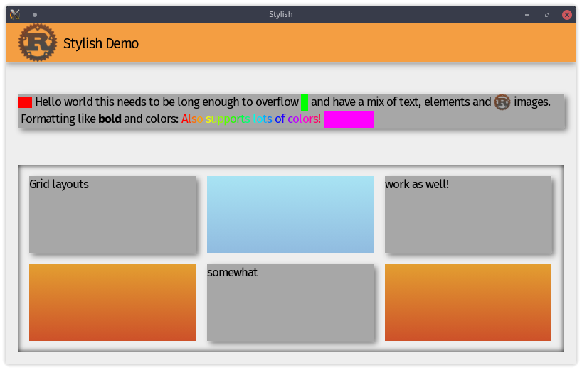

# Stylish

A webrender based UI system that can (hopefully) be used in games.

## Demo

```bash
cargo run -p stylish_webrender --example demo --release
```
Note: SDL2 is needed to use stylish

[A slightly more complex example can be found here](https://github.com/Thinkofname/stylish_example)

## Screenshots


